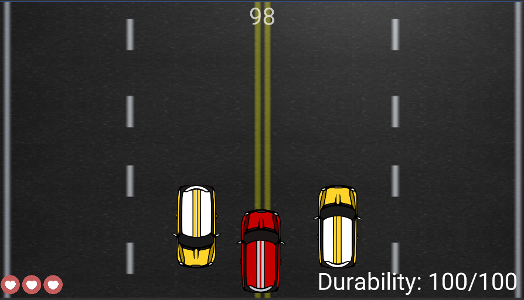
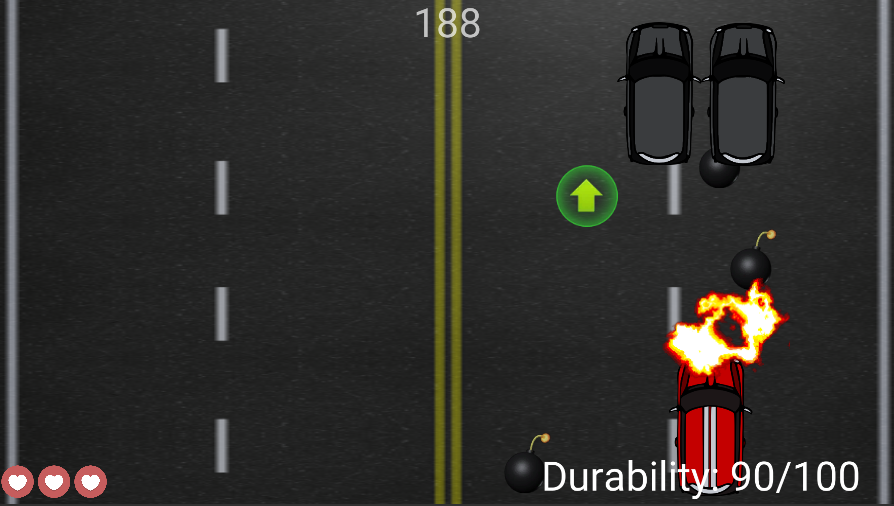
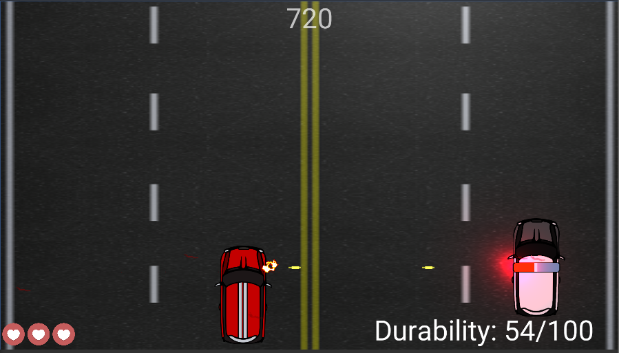

# RacingGame
 >C#, Unity version: 2019.1.2f1
 
 Simple game created in Unity
 

# Visuals and description

##### Menu

#### Gameplay

In this game we play the fugitives. The player is a red car and we run away from the police. 
During the waves, three "bonuses" appear randomly.
The first one is the "yellow shield", thanks to which we do not lose our durability during collisions with other cars, swinging a bomb and a police shot.
The second "green arrow" causes the car to accelerate temporarily.
The last "red flat key" which gives us 20 durability points.
If our durability drops below 0, we lose one "life". We have 3 "lives" in the game.

### First "wave" 
The player's task is to avoid other cars without hitting them. Otherwise, the player's durability points will be subtracted.

### Second "wave" 
The player's task is to avoid the bombs thrown by two black cars. When the player runs over the bomb, the bomb explodes and hit points are subtracted.

### Third "wave" 
The player's task is to throw every police car out of the way. Police cars shoot at the player's car, taking durability points from him.

